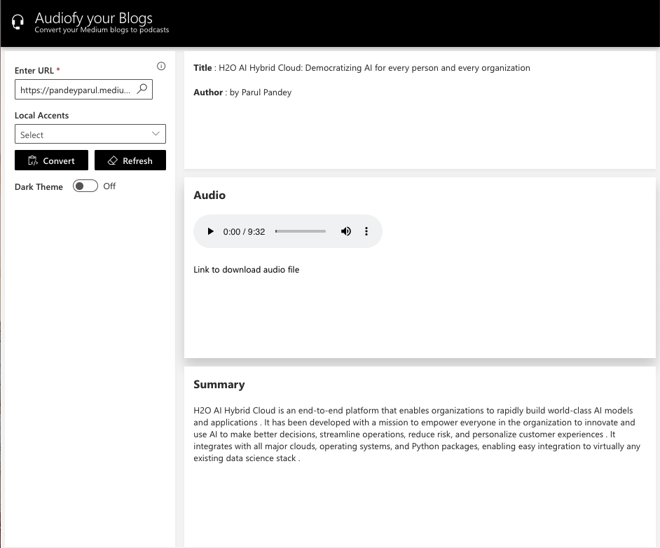
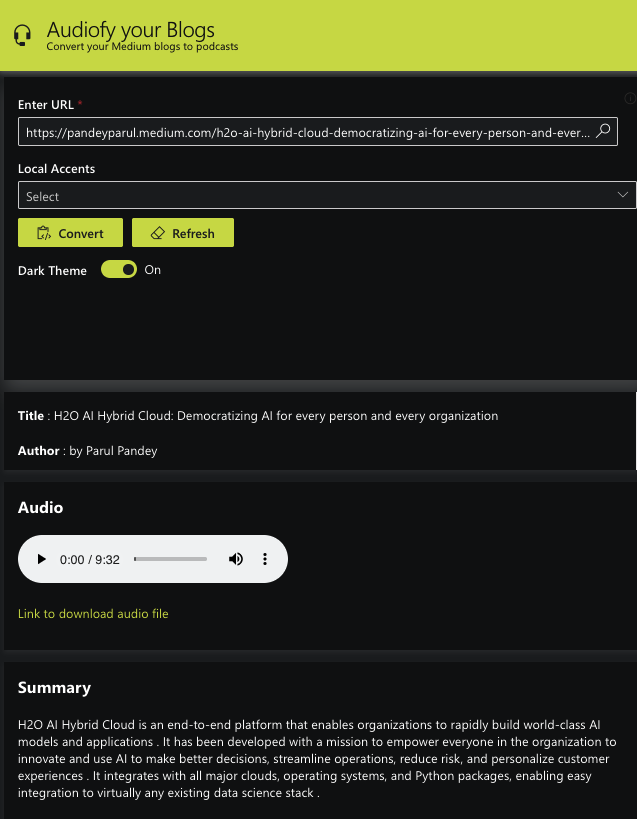

# Audiophy your Medium Blogs 






## Running this App Locally

### System Requirements

1. Python 3.6+
2. pip3


### 1. Run the Wave Server

New to H2O Wave? We recommend starting in the documentation to [download and run](https://wave.h2o.ai/docs/installation) the Wave Server on your local machine. Once the server is up and running you can easily use any Wave app.

### 2. Setup Your Python Environment

```bash
$ git clone git@github.com/parulnith/audiophy-2.git
$ cd audiopy
$ python3 -m venv venv
$ source venv/bin/activate
$ pip3 install -r requirements.txt

```

### 3. Run the App

```bash
wave run src.app
```

Note! If you did not activate your virtual environment this will be:

```bash
./venv/bin/wave run src.app
```

### 4. View the App

Point your favorite web browser to [localhost:10101](http://localhost:10101)
